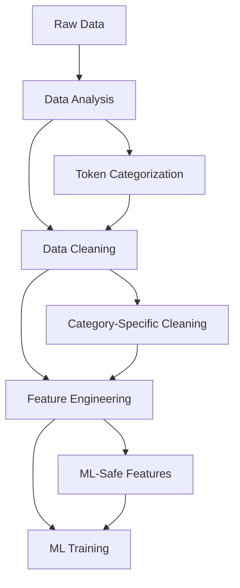

# 🤖 Machine Learning Pipeline for Memecoin Prediction

> **Comprehensive ML platform with temporal leak prevention, category-aware processing, and multi-horizon prediction capabilities for memecoin time series analysis**

## 🎯 Overview

The `ML` module implements a sophisticated machine learning pipeline specifically designed for **24-hour minute-by-minute memecoin prediction**. This module provides both **directional models** (UP/DOWN classification) and **forecasting models** (price value regression) with rigorous **temporal splitting** and **data leakage prevention**.

### 🪙 Memecoin-Specific ML Design

**CRITICAL DESIGN PRINCIPLES**:
- **TEMPORAL INTEGRITY**: Strict within-token temporal splitting (60% train, 20% val, 20% test)
- **NO DATA LEAKAGE**: Features use only past information, validated at 1e-12 precision
- **PER-TOKEN SCALING**: Individual scaling per token to handle variable price ranges
- **CATEGORY-AWARE PROCESSING**: Different strategies for normal, extreme, dead, and gap tokens
- **MULTI-HORIZON PREDICTION**: Unified models predicting 15m-720m simultaneously

---

## 🏗️ Architecture & Components

### **Directory Structure**

```
ML/
├── directional_models/          # Binary classification (UP/DOWN prediction)
│   ├── train_lightgbm_model.py              # Short-term tree-based models
│   ├── train_lightgbm_model_medium_term.py  # Medium-term tree-based models  
│   ├── train_unified_lstm_model.py          # 🆕 Unified LSTM (all horizons)
│   ├── train_advanced_hybrid_lstm.py        # 🚀 State-of-the-art hybrid model
│   ├── train_logistic_regression_baseline.py # Simple baseline model
│   └── analyze_returns_distribution.py      # Data distribution analysis
├── forecasting_models/         # Regression (price value prediction)
│   ├── train_lstm_model.py                  # Basic LSTM forecasting
│   ├── train_advanced_hybrid_lstm_forecasting.py # Advanced hybrid forecasting
│   ├── train_baseline_regressors.py         # Linear/XGBoost baselines
│   ├── predict_with_model.py                # Model inference utility
│   └── analyze_results.py                   # Performance analysis
├── hyperparameter_tuning/      # Automated hyperparameter optimization
│   ├── tune_lightgbm_directional.py         # LightGBM optimization
│   ├── tune_lstm_directional.py             # LSTM optimization
│   ├── tune_logistic_regression.py          # LogReg optimization
│   ├── tune_forecasting_lstm.py             # Forecasting LSTM tuning
│   ├── tune_forecasting_regressors.py       # Regression model tuning
│   └── utils/tuning_helpers.py              # Shared tuning utilities
├── utils/                      # Shared ML utilities
│   ├── winsorizer.py                        # Crypto-optimized scaling
│   ├── walk_forward_splitter.py             # Time series validation
│   ├── metrics_helpers.py                   # Performance calculation
│   ├── training_plots.py                    # Visualization utilities
│   └── compare_scaling_methods.py           # Scaling method comparison
├── results/                    # Model outputs and performance metrics
└── tests/                      # Mathematical validation tests
```

---

## 🎯 Directional Models (Binary Classification)

### **🚀 Advanced Hybrid LSTM** (State-of-the-Art)

The most sophisticated model combining multiple innovations for superior performance.

#### **Architecture Overview**
```python
class AdvancedHybridLSTM(nn.Module):
    def __init__(self):
        # Multi-scale fixed window LSTMs
        self.fixed_lstms = {
            '15m': LSTM(hidden_size=42),   # 15-minute patterns
            '60m': LSTM(hidden_size=42),   # 1-hour patterns  
            '240m': LSTM(hidden_size=42),  # 4-hour patterns
        }
        
        # Expanding window LSTM (adaptive history)
        self.expanding_lstm = LSTM(hidden_size=128, num_layers=2)
        
        # Attention mechanisms
        self.self_attention = MultiheadAttention(num_heads=8)
        self.cross_attention = MultiheadAttention(num_heads=8)
        
        # Hierarchical feature fusion
        self.fusion_layer = nn.Sequential(
            nn.Linear(256, 128),
            nn.LayerNorm(128),
            nn.ReLU(),
            nn.Dropout(0.3)
        )
```

#### **Key Innovations**

1. **Multi-Scale Feature Extraction**
   - Processes data at 3 time scales simultaneously
   - Captures patterns from micro (15m) to macro (4h) timeframes
   - Each scale has dedicated LSTM processing

2. **Hybrid Window Approach**
   - Fixed windows: 15m, 1h, 4h for consistent patterns
   - Expanding window: 60m-12h for lifecycle awareness
   - Combines benefits of both approaches

3. **Attention Mechanisms**
   - Self-attention on expanding window sequences
   - Cross-attention between fixed and expanding features
   - Intelligent focus on important timepoints

4. **Optimized Training**
   ```python
   optimizer = optim.AdamW([
       {'params': model.fixed_lstms.parameters(), 'lr': 0.0005},
       {'params': model.attention.parameters(), 'lr': 0.00025},
       {'params': model.fusion_layer.parameters(), 'lr': 0.001}
   ])
   ```

#### **Performance Improvements**
- **Accuracy**: +5-10% over basic LSTM
- **F1 Score**: +8-15% improvement
- **ROC AUC**: +3-7% boost
- **Training Time**: 2-3x longer

### **🆕 Unified LSTM Model**

Single model predicting all horizons (15m-720m) with shared representations.

#### **Architecture Features**
```python
class UnifiedLSTMPredictor(nn.Module):
    def __init__(self, input_size, hidden_size=32, num_layers=2):
        super().__init__()
        
        # Shared LSTM backbone
        self.lstm = nn.LSTM(
            input_size=input_size,
            hidden_size=hidden_size,
            num_layers=num_layers,
            dropout=0.2,
            batch_first=True
        )
        
        # Separate prediction heads for each horizon
        self.prediction_heads = nn.ModuleDict({
            f'{h}m': nn.Sequential(
                nn.Linear(hidden_size, hidden_size // 2),
                nn.ReLU(),
                nn.Dropout(0.2),
                nn.Linear(hidden_size // 2, 1),
                nn.Sigmoid()
            ) for h in [15, 30, 60, 120, 240, 360, 720]
        })
```

#### **Benefits**
- **Efficiency**: Train once, predict all horizons
- **Consistency**: Same scaling and feature approach across horizons
- **Shared Learning**: Cross-horizon pattern recognition
- **Maintenance**: Single model to maintain and deploy

### **⚡ LightGBM Models**

Fast, interpretable tree-based models with pre-engineered features.

#### **Short-Term Model** (`train_lightgbm_model.py`)
```python
CONFIG = {
    'horizons': [15, 30, 60],  # Minutes
    'lgb_params': {
        'objective': 'binary',
        'metric': 'auc',
        'learning_rate': 0.05,
        'feature_fraction': 0.8,
        'bagging_fraction': 0.8,
        'n_estimators': 500,
        'min_child_samples': 20,
        'reg_alpha': 0.1,
        'reg_lambda': 0.1
    }
}
```

#### **Medium-Term Model** (`train_lightgbm_model_medium_term.py`)
```python
CONFIG = {
    'horizons': [120, 240, 360, 720],  # 2h, 4h, 6h, 12h
    'lgb_params': {
        # Optimized for longer horizons
        'learning_rate': 0.03,
        'max_depth': 8,
        'num_leaves': 255
    }
}
```

#### **Feature Categories Used**
- **Technical Indicators**: RSI, MACD, Bollinger Bands, ATR
- **Price Features**: Log returns, rolling means/std, momentum
- **Statistical Features**: Skewness, kurtosis, VaR calculations
- **FFT Features**: Frequency domain patterns, cyclical detection

### **📊 Logistic Regression Baseline**

Simple, interpretable baseline for performance comparison.

```python
from sklearn.linear_model import LogisticRegression
from sklearn.preprocessing import RobustScaler

model = LogisticRegression(
    C=1.0,
    penalty='l2',
    solver='liblinear',
    random_state=42,
    max_iter=1000
)
```

---

## 📈 Forecasting Models (Regression)

### **🧠 Advanced Hybrid LSTM Forecasting**

Multi-scale forecasting with attention mechanisms for price value prediction.

#### **Architecture**
```python
class AdvancedHybridLSTMForecasting(nn.Module):
    def __init__(self):
        # Multi-resolution processing
        self.short_term_lstm = LSTM(hidden_size=64)    # 1-hour patterns
        self.medium_term_lstm = LSTM(hidden_size=64)   # 4-hour patterns
        self.long_term_lstm = LSTM(hidden_size=64)     # 12-hour patterns
        
        # Attention fusion
        self.attention_fusion = MultiheadAttention(
            embed_dim=192,  # 3 * 64
            num_heads=8
        )
        
        # Price prediction head
        self.price_predictor = nn.Sequential(
            nn.Linear(192, 96),
            nn.ReLU(),
            nn.Dropout(0.3),
            nn.Linear(96, 48),
            nn.ReLU(),
            nn.Linear(48, 1)  # Single price output
        )
```

### **📊 Baseline Regressors**

#### **Linear Regression with Regularization**
```python
from sklearn.linear_model import Ridge, Lasso, ElasticNet

models = {
    'ridge': Ridge(alpha=1.0),
    'lasso': Lasso(alpha=0.1),
    'elastic': ElasticNet(alpha=0.1, l1_ratio=0.5)
}
```

#### **XGBoost Regression**
```python
from xgboost import XGBRegressor

model = XGBRegressor(
    n_estimators=500,
    learning_rate=0.05,
    max_depth=6,
    subsample=0.8,
    colsample_bytree=0.8,
    objective='reg:squarederror',
    random_state=42
)
```

---

## 🛡️ Data Leakage Prevention Framework

### **Critical Issues Identified & Fixed**

#### **1. Temporal Splitting Within Tokens**
```python
# ❌ WRONG: Random token splits
train_tokens, test_tokens = train_test_split(all_tokens, test_size=0.2)

# ✅ CORRECT: Temporal splits within each token
def prepare_data_with_temporal_splitting(token_paths, split_type):
    for token_path in token_paths:
        features_df = load_features_from_file(token_path)
        n_rows = features_df.height
        
        if split_type == 'train':
            start_idx, end_idx = 0, int(n_rows * 0.6)          # First 60%
        elif split_type == 'val':
            start_idx, end_idx = int(n_rows * 0.6), int(n_rows * 0.8)  # Next 20%
        elif split_type == 'test':
            start_idx, end_idx = int(n_rows * 0.8), n_rows     # Last 20%
        
        token_split = features_df.slice(start_idx, end_idx - start_idx)
        yield token_split
```

#### **2. Per-Token Scaling Strategy**
```python
# ❌ WRONG: Global scaling across all tokens
all_prices = concatenate([token.prices for token in tokens])
global_scaler.fit(all_prices)

# ✅ CORRECT: Individual scaling per token
class PerTokenScaler:
    def __init__(self):
        self.token_scalers = {}
    
    def fit_transform_token(self, token_data, token_name):
        scaler = RobustScaler()
        
        # Fit only on training portion
        train_data = token_data[:int(0.6 * len(token_data))]
        scaler.fit(train_data)
        
        # Handle zero IQR (constant features)
        zero_iqr_mask = np.isclose(scaler.scale_, 0)
        if np.any(zero_iqr_mask):
            scaler.scale_[zero_iqr_mask] = 1.0
        
        self.token_scalers[token_name] = scaler
        return scaler.transform(token_data)
```

#### **3. Feature Engineering Temporal Safety**
```python
def validate_features_safety(features_df, token_name):
    """Validate that no future information leaks into features"""
    
    unsafe_patterns = [
        'total_return', 'max_gain', 'max_drawdown', 'price_range',
        'global_', 'spectral_entropy', 'max_periodicity'
    ]
    
    for col in features_df.columns:
        # Check for constant features (potential leakage)
        unique_count = features_df[col].n_unique()
        if unique_count == 1:
            unique_val = features_df[col].drop_nulls().unique().to_list()[0]
            if abs(unique_val) > 1e-10:  # Non-zero constant
                logger.warning(f"Constant feature detected: {col} = {unique_val}")
                return False
        
        # Check for unsafe feature patterns
        for pattern in unsafe_patterns:
            if pattern in col.lower():
                logger.warning(f"Potentially unsafe feature: {col}")
                return False
    
    return True
```

#### **4. Dead Token Constant Period Removal**
```python
def remove_death_period(df, token_name):
    """Remove constant price periods to prevent data leakage"""
    
    prices = df['price'].to_numpy()
    constant_count = 0
    
    # Count constant prices from the end
    for i in range(len(prices) - 1, 0, -1):
        if prices[i] == prices[i-1]:
            constant_count += 1
        else:
            break
    
    if constant_count >= 60:  # 1+ hour of constant prices
        remove_count = constant_count - 2  # Keep 2 minutes for context
        df_cleaned = df.head(df.height - remove_count)
        logger.info(f"Removed {remove_count} constant periods from {token_name}")
        return df_cleaned
    
    return df
```

---

## 📊 Performance Metrics & Evaluation

### **Classification Metrics (Directional Models)**

```python
def comprehensive_classification_metrics(y_true, y_pred, y_prob):
    """Calculate comprehensive classification metrics"""
    
    return {
        # Primary metrics
        'accuracy': accuracy_score(y_true, y_pred),
        'roc_auc': roc_auc_score(y_true, y_prob),
        
        # Precision/Recall metrics
        'precision': precision_score(y_true, y_pred, zero_division=0),
        'recall': recall_score(y_true, y_pred, zero_division=0),
        'f1_score': f1_score(y_true, y_pred, zero_division=0),
        
        # Class distribution
        'positive_ratio': np.mean(y_true),
        'prediction_ratio': np.mean(y_pred),
        
        # Financial metrics
        'sharpe_ratio': calculate_sharpe_ratio(y_true, y_pred),
        'max_drawdown': calculate_max_drawdown(y_true, y_pred),
        'win_rate': calculate_win_rate(y_true, y_pred)
    }
```

### **Regression Metrics (Forecasting Models)**

```python
def comprehensive_regression_metrics(y_true, y_pred):
    """Calculate comprehensive regression metrics"""
    
    mse = mean_squared_error(y_true, y_pred)
    mae = mean_absolute_error(y_true, y_pred)
    
    # Price-specific metrics
    mape = np.mean(np.abs((y_true - y_pred) / y_true)) * 100
    directional_accuracy = np.mean(
        np.sign(y_true - y_true.shift(1)) == np.sign(y_pred - y_true.shift(1))
    )
    
    return {
        'mae': mae,
        'mse': mse,
        'rmse': np.sqrt(mse),
        'r2': r2_score(y_true, y_pred),
        'mape': mape,
        'directional_accuracy': directional_accuracy,
        'correlation': np.corrcoef(y_true, y_pred)[0, 1]
    }
```

### **Expected Performance Benchmarks**

#### **Directional Models**
```python
performance_benchmarks = {
    'excellent': {
        'accuracy': (0.85, 0.95),
        'roc_auc': (0.85, 0.95),
        'f1_score': (0.70, 0.85),
        'precision': (0.75, 0.90),
        'recall': (0.65, 0.85)
    },
    'good': {
        'accuracy': (0.75, 0.85),
        'roc_auc': (0.75, 0.85),
        'f1_score': (0.60, 0.70),
        'precision': (0.65, 0.75),
        'recall': (0.55, 0.65)
    },
    'acceptable': {
        'accuracy': (0.65, 0.75),
        'roc_auc': (0.65, 0.75),
        'f1_score': (0.50, 0.60),
        'precision': (0.55, 0.65),
        'recall': (0.45, 0.55)
    }
}
```

#### **Forecasting Models**
```python
forecasting_benchmarks = {
    'excellent': {
        'r2': (0.5, 0.8),
        'mape': (5, 15),  # 5-15% mean absolute percentage error
        'directional_accuracy': (0.65, 0.80),
        'correlation': (0.7, 0.9)
    },
    'good': {
        'r2': (0.3, 0.5),
        'mape': (15, 25),
        'directional_accuracy': (0.55, 0.65),
        'correlation': (0.5, 0.7)
    },
    'acceptable': {
        'r2': (0.1, 0.3),
        'mape': (25, 40),
        'directional_accuracy': (0.50, 0.55),
        'correlation': (0.3, 0.5)
    }
}
```

---

## 🎛️ Hyperparameter Tuning Framework

### **Automated Optimization with Optuna**

#### **LightGBM Tuning**
```python
def optimize_lightgbm_params(trial):
    """Optuna objective function for LightGBM optimization"""
    
    params = {
        'objective': 'binary',
        'metric': 'auc',
        'learning_rate': trial.suggest_float('learning_rate', 0.01, 0.3, log=True),
        'feature_fraction': trial.suggest_float('feature_fraction', 0.4, 1.0),
        'bagging_fraction': trial.suggest_float('bagging_fraction', 0.4, 1.0),
        'bagging_freq': trial.suggest_int('bagging_freq', 1, 7),
        'min_child_samples': trial.suggest_int('min_child_samples', 5, 100),
        'num_leaves': trial.suggest_int('num_leaves', 10, 300),
        'reg_alpha': trial.suggest_float('reg_alpha', 0.0, 10.0),
        'reg_lambda': trial.suggest_float('reg_lambda', 0.0, 10.0),
        'max_depth': trial.suggest_int('max_depth', 3, 15),
        'n_estimators': trial.suggest_int('n_estimators', 100, 1000)
    }
    
    # Cross-validation with temporal splits
    cv_scores = []
    for fold in range(5):
        model = lgb.LGBMClassifier(**params, random_state=42, verbose=-1)
        # Train and validate using walk-forward approach
        score = walk_forward_validate(model, X_train, y_train)
        cv_scores.append(score)
    
    return np.mean(cv_scores)
```

#### **LSTM Tuning**
```python
def optimize_lstm_params(trial):
    """Optuna objective function for LSTM optimization"""
    
    config = {
        'hidden_size': trial.suggest_categorical('hidden_size', [16, 32, 64, 128]),
        'num_layers': trial.suggest_int('num_layers', 1, 4),
        'dropout': trial.suggest_float('dropout', 0.0, 0.5),
        'learning_rate': trial.suggest_float('learning_rate', 1e-5, 1e-2, log=True),
        'batch_size': trial.suggest_categorical('batch_size', [16, 32, 64, 128]),
        'sequence_length': trial.suggest_categorical('sequence_length', [30, 60, 120, 240]),
        'weight_decay': trial.suggest_float('weight_decay', 1e-6, 1e-2, log=True)
    }
    
    # Train model with suggested parameters
    model = UnifiedLSTMPredictor(**config)
    trainer = LSTMTrainer(model, config)
    val_score = trainer.train_and_validate()
    
    return val_score
```

### **Hyperparameter Tuning Commands**

```bash
# Directional model tuning
python ML/hyperparameter_tuning/tune_lightgbm_directional.py --horizon 60 --n_trials 100
python ML/hyperparameter_tuning/tune_lstm_directional.py --horizon 60 --n_trials 50
python ML/hyperparameter_tuning/tune_logistic_regression.py --horizon 60 --n_trials 100

# Forecasting model tuning
python ML/hyperparameter_tuning/tune_forecasting_lstm.py --horizon 60 --n_trials 50
python ML/hyperparameter_tuning/tune_forecasting_regressors.py --horizon 60 --model xgboost
```

---

## 🧰 Utilities & Helper Functions

### **🔧 Winsorizer (Crypto-Optimized Scaling)**

```python
from ML.utils.winsorizer import Winsorizer

# Better for crypto data with extreme outliers
winsorizer = Winsorizer(limits=(0.005, 0.995))  # Cap at 0.5% and 99.5%
winsorizer.fit(features)
features_scaled = winsorizer.transform(features)

# Benefits over RobustScaler:
# - Handles extreme crypto volatility better
# - No division-by-zero issues
# - More interpretable (percentile-based)
# - Preserves distribution shape while capping extremes
```

### **📊 Walk-Forward Validation**

```python
from ML.utils.walk_forward_splitter import WalkForwardSplitter

splitter = WalkForwardSplitter(
    n_splits=5,
    test_size=0.2,
    gap=0  # No gap between train and test
)

# Time series cross-validation
for train_idx, test_idx in splitter.split(X):
    X_train_fold, X_test_fold = X[train_idx], X[test_idx]
    y_train_fold, y_test_fold = y[train_idx], y[test_idx]
    
    # Train and validate model
    model.fit(X_train_fold, y_train_fold)
    predictions = model.predict(X_test_fold)
    
    # Calculate metrics
    fold_score = calculate_metrics(y_test_fold, predictions)
```

### **📈 Training Plots & Visualization**

```python
from ML.utils.training_plots import create_training_visualization

# Comprehensive training visualization
plots = create_training_visualization(
    metrics_history=training_history,
    validation_results=val_results,
    feature_importance=feature_importance,
    model_name="LightGBM_60m"
)

# Saves interactive HTML plots to results/
```

### **📊 Metrics Helpers**

```python
from ML.utils.metrics_helpers import (
    financial_classification_metrics,
    calculate_sharpe_ratio,
    calculate_max_drawdown,
    plot_confusion_matrix,
    plot_roc_curve
)

# Financial-focused metrics
financial_metrics = financial_classification_metrics(
    y_true=y_test,
    y_pred=predictions,
    y_prob=probabilities,
    include_plots=True
)
```

---

## 🚀 Getting Started Guide

### **Prerequisites & Installation**

```bash
# 1. Ensure data pipeline completion
ls data/cleaned/          # Should show: normal_behavior_tokens, tokens_with_extremes, etc.
ls data/features/         # Should show: TOKEN_NAME_features.parquet files

# 2. Install ML dependencies
pip install -r requirements.txt

# Key packages:
# - polars           # Fast dataframes
# - lightgbm         # Gradient boosting
# - torch            # Deep learning
# - scikit-learn     # Traditional ML
# - optuna           # Hyperparameter tuning
# - plotly           # Interactive visualizations
# - xgboost          # Additional boosting
# - tqdm             # Progress bars
```

### **Complete Workflow (Recommended Order)**

#### **1. Data Preparation**
```bash
# Step 1: Data analysis and categorization
streamlit run data_analysis/app.py
# → Use "Export All Categories (Mutually Exclusive)" button

# Step 2: Data cleaning
python data_cleaning/clean_tokens.py

# Step 3: Feature engineering (CRITICAL)
python feature_engineering/advanced_feature_engineering.py

# Step 4: Create targets
python feature_engineering/create_directional_targets.py
```

#### **2. Model Training (Choose Your Path)**

**Option A: Quick Start (Recommended)**
```bash
# Train unified model (all horizons at once)
python ML/directional_models/train_unified_lstm_model.py

# Train fast baseline
python ML/directional_models/train_lightgbm_model.py
```

**Option B: Comprehensive Training**
```bash
# Directional models
python ML/directional_models/train_lightgbm_model.py                    # Short-term tree-based
python ML/directional_models/train_lightgbm_model_medium_term.py        # Medium-term tree-based
python ML/directional_models/train_unified_lstm_model.py                # All horizons LSTM
python ML/directional_models/train_advanced_hybrid_lstm.py              # State-of-the-art
python ML/directional_models/train_logistic_regression_baseline.py      # Simple baseline

# Forecasting models
python ML/forecasting_models/train_lstm_model.py                        # Basic forecasting
python ML/forecasting_models/train_advanced_hybrid_lstm_forecasting.py  # Advanced forecasting
python ML/forecasting_models/train_baseline_regressors.py --horizon 60 --model both
```

#### **3. Hyperparameter Optimization (Optional)**
```bash
# Optimize key models
python ML/hyperparameter_tuning/tune_lightgbm_directional.py --horizon 60 --n_trials 100
python ML/hyperparameter_tuning/tune_lstm_directional.py --horizon 60 --n_trials 50
```

#### **4. Model Evaluation & Analysis**
```bash
# Analyze model performance
python ML/directional_models/analyze_returns_distribution.py
python ML/forecasting_models/analyze_results.py

# Compare scaling methods
python ML/utils/compare_scaling_methods.py
```

### **Expected Training Times**

```python
training_times = {
    'lightgbm_short_term': '2-5 minutes',
    'lightgbm_medium_term': '3-7 minutes',
    'unified_lstm': '15-45 minutes',
    'advanced_hybrid_lstm': '45-120 minutes',
    'logistic_regression': '1-3 minutes',
    'lstm_forecasting': '20-60 minutes',
    'hyperparameter_tuning': '2-8 hours per model'
}
```

---

## 📊 Results Structure & Interpretation

### **Output Directory Structure**

```
ML/results/
├── lightgbm_short_term/                    # Short-term LightGBM results
│   ├── lightgbm_model_15m.joblib          # Trained models
│   ├── lightgbm_model_30m.joblib
│   ├── lightgbm_model_60m.joblib
│   ├── metrics.json                       # Performance metrics
│   ├── lightgbm_short_term_metrics.html   # Interactive visualization
│   └── feature_importance.json            # Feature ranking
├── unified_lstm_directional/              # Unified LSTM results
│   ├── unified_lstm_model.pth            # Single model for all horizons
│   ├── token_scalers.joblib              # Per-token scaling parameters
│   ├── metrics.json                       # Comprehensive metrics
│   ├── unified_lstm_metrics.html          # Training curves & performance
│   └── config.json                        # Model configuration
├── advanced_hybrid_lstm/                  # State-of-the-art results
│   ├── advanced_hybrid_model.pth          # Complex hybrid model
│   ├── attention_weights.npz              # Attention visualizations
│   ├── multi_scale_metrics.json           # Scale-specific performance
│   └── advanced_hybrid_analysis.html      # Detailed analysis
├── forecasting_models/                    # Price prediction results
│   ├── lstm_forecasting/
│   ├── baseline_regressors/
│   └── advanced_hybrid_forecasting/
└── hyperparameter_tuning/                 # Optimization results
    ├── lightgbm_directional_60m_best_params.json
    ├── lstm_directional_60m_best_params.json
    └── tuning_trials.csv                  # All trial results
```

### **Performance Interpretation Guide**

#### **Classification Results**
```json
{
  "15m_horizon": {
    "accuracy": 0.87,          // 87% correct direction predictions
    "roc_auc": 0.91,           // Excellent discrimination ability
    "precision": 0.79,         // When predicting UP, 79% correct
    "recall": 0.73,            // Catches 73% of actual UP movements
    "f1_score": 0.76,          // Balanced precision/recall
    "positive_ratio": 0.49     // 49% UP vs 51% DOWN (balanced)
  }
}
```

**Interpretation:**
- **87% Accuracy**: Model correctly predicts direction 8.7 times out of 10
- **91% ROC AUC**: Excellent ability to distinguish UP from DOWN
- **Balanced Classes**: Near 50/50 split means accuracy is genuine performance

#### **Forecasting Results**
```json
{
  "60m_horizon": {
    "r2": 0.45,                        // Explains 45% of price variance
    "mae": 0.08,                       // 8% mean absolute error
    "mape": 12.3,                      // 12.3% mean absolute percentage error
    "directional_accuracy": 0.68,      // 68% correct direction
    "correlation": 0.72                // Strong price correlation
  }
}
```

**Interpretation:**
- **45% R²**: Model captures nearly half of price movements
- **8% MAE**: Typical prediction error is 8% of actual price
- **68% Directional**: Even when magnitude is off, direction is usually right

---

## ⚙️ Advanced Configuration & Tuning

### **Model-Specific Configurations**

#### **LightGBM Optimization**
```python
# High-performance configuration
lgb_config_performance = {
    'learning_rate': 0.05,
    'feature_fraction': 0.8,
    'bagging_fraction': 0.8,
    'bagging_freq': 5,
    'min_child_samples': 20,
    'num_leaves': 127,
    'reg_alpha': 0.1,
    'reg_lambda': 0.1,
    'max_depth': 8,
    'n_estimators': 500
}

# Memory-efficient configuration
lgb_config_efficient = {
    'learning_rate': 0.1,
    'feature_fraction': 0.6,
    'bagging_fraction': 0.6,
    'num_leaves': 31,
    'max_depth': 5,
    'n_estimators': 200
}
```

#### **LSTM Optimization**
```python
# High-accuracy configuration
lstm_config_accuracy = {
    'hidden_size': 64,
    'num_layers': 3,
    'dropout': 0.3,
    'learning_rate': 0.0005,
    'batch_size': 32,
    'sequence_length': 120,
    'weight_decay': 0.01
}

# Fast training configuration
lstm_config_fast = {
    'hidden_size': 32,
    'num_layers': 2,
    'dropout': 0.2,
    'learning_rate': 0.001,
    'batch_size': 64,
    'sequence_length': 60,
    'weight_decay': 0.001
}
```

#### **Advanced Hybrid LSTM Configuration**
```python
# Maximum performance configuration
hybrid_config_max = {
    'fixed_window_sizes': [15, 60, 240],
    'expanding_window_max': 720,
    'hidden_size': 128,
    'attention_heads': 8,
    'dropout': 0.4,
    'learning_rate': 0.0001,
    'batch_size': 16,    # Smaller due to complexity
    'gradient_clip': 1.0
}

# Resource-constrained configuration
hybrid_config_efficient = {
    'fixed_window_sizes': [15, 60],
    'expanding_window_max': 360,
    'hidden_size': 64,
    'attention_heads': 4,
    'dropout': 0.3,
    'learning_rate': 0.0005,
    'batch_size': 32
}
```

### **Scaling Method Comparison**

```python
# Test different scaling approaches
scaling_methods = {
    'robust_scaler': RobustScaler(),
    'winsorizer_conservative': Winsorizer(limits=(0.01, 0.99)),
    'winsorizer_aggressive': Winsorizer(limits=(0.005, 0.995)),
    'standard_scaler': StandardScaler(),  # For comparison
    'min_max_scaler': MinMaxScaler()      # For comparison
}

# Run comparison
python ML/utils/compare_scaling_methods.py --output_dir ML/results/scaling_comparison
```

---

## 🚨 Common Issues & Troubleshooting

### **❌ Data-Related Issues**

**Problem**: "No feature files found"
```python
# Solution: Verify feature engineering completion
feature_dir = Path("data/features")
if not feature_dir.exists():
    print("Run: python feature_engineering/advanced_feature_engineering.py")

feature_files = list(feature_dir.glob("*.parquet"))
if len(feature_files) == 0:
    print("Feature engineering did not complete successfully")
else:
    print(f"Found {len(feature_files)} feature files")
```

**Problem**: High accuracy but suspicious metrics (>95%)
```python
# Solution: Check for data leakage
def diagnose_data_leakage(y_true, y_pred, features_df):
    """Diagnose potential data leakage issues"""
    
    # Check class distribution
    pos_ratio = np.mean(y_true)
    if pos_ratio < 0.1 or pos_ratio > 0.9:
        print(f"⚠️ Extreme class imbalance: {pos_ratio:.3f}")
    
    # Check for constant features
    constant_features = []
    for col in features_df.columns:
        if features_df[col].n_unique() == 1:
            constant_features.append(col)
    
    if constant_features:
        print(f"⚠️ Constant features detected: {constant_features}")
    
    # Check temporal consistency
    if len(set(y_true)) == 1:
        print("⚠️ All labels are identical - major data leakage!")
    
    return {
        'pos_ratio': pos_ratio,
        'constant_features': constant_features,
        'label_variance': np.var(y_true)
    }
```

### **❌ Performance Issues**

**Problem**: Out of memory during training
```python
# Solution: Reduce memory usage
def optimize_memory_usage():
    """Optimize memory usage during training"""
    
    # 1. Reduce batch size
    config['batch_size'] = min(config['batch_size'], 16)
    
    # 2. Use gradient accumulation
    config['gradient_accumulation_steps'] = 4
    
    # 3. Clear cache frequently
    if torch.cuda.is_available():
        torch.cuda.empty_cache()
    
    # 4. Use mixed precision training
    config['use_amp'] = True
    
    return config
```

**Problem**: Slow training speed
```python
# Solution: Optimize training speed
def optimize_training_speed():
    """Optimize training speed"""
    
    # 1. Use DataLoader with multiple workers
    config['num_workers'] = 4
    config['pin_memory'] = True
    
    # 2. Increase batch size if memory allows
    config['batch_size'] = min(config['batch_size'] * 2, 128)
    
    # 3. Use compiled models (PyTorch 2.0+)
    if hasattr(torch, 'compile'):
        model = torch.compile(model)
    
    # 4. Enable CUDA optimizations
    if torch.cuda.is_available():
        torch.backends.cudnn.benchmark = True
    
    return config
```

### **❌ Model Quality Issues**

**Problem**: Poor generalization (high train, low validation)
```python
# Solution: Increase regularization
def increase_regularization(config, model_type):
    """Increase regularization to prevent overfitting"""
    
    if model_type == 'lightgbm':
        config['lgb_params'].update({
            'reg_alpha': config['lgb_params'].get('reg_alpha', 0.1) * 2,
            'reg_lambda': config['lgb_params'].get('reg_lambda', 0.1) * 2,
            'feature_fraction': min(config['lgb_params'].get('feature_fraction', 0.8), 0.7),
            'bagging_fraction': min(config['lgb_params'].get('bagging_fraction', 0.8), 0.7)
        })
    
    elif model_type == 'lstm':
        config.update({
            'dropout': min(config.get('dropout', 0.2) + 0.1, 0.5),
            'weight_decay': config.get('weight_decay', 0.001) * 2,
            'learning_rate': config.get('learning_rate', 0.001) * 0.8
        })
    
    return config
```

**Problem**: Model predicts only one class
```python
# Solution: Address class imbalance
def handle_class_imbalance(y_train):
    """Handle class imbalance in training data"""
    
    pos_ratio = np.mean(y_train)
    
    if pos_ratio < 0.3:  # Too few positive examples
        # Use class weights
        pos_weight = (1 - pos_ratio) / pos_ratio
        
        # For LightGBM
        lgb_params['scale_pos_weight'] = pos_weight
        
        # For PyTorch
        criterion = nn.BCEWithLogitsLoss(pos_weight=torch.tensor(pos_weight))
        
    return pos_weight
```

---

## 🔮 Future Enhancements & Research Directions

### **Planned Model Improvements**

#### **1. Advanced Ensemble Methods**
```python
class MetaEnsemble:
    """Meta-learning ensemble combining multiple model types"""
    
    def __init__(self):
        self.base_models = {
            'lightgbm': LightGBMDirectional(),
            'lstm': UnifiedLSTM(),
            'hybrid': AdvancedHybridLSTM()
        }
        self.meta_learner = LogisticRegression()
    
    def fit(self, X, y):
        # Train base models
        base_predictions = {}
        for name, model in self.base_models.items():
            model.fit(X, y)
            base_predictions[name] = model.predict_proba(X)
        
        # Train meta-learner on base predictions
        meta_features = np.column_stack(list(base_predictions.values()))
        self.meta_learner.fit(meta_features, y)
```

#### **2. Dynamic Feature Selection**
```python
class AdaptiveFeatureSelector:
    """Select optimal features dynamically per token/horizon"""
    
    def select_features_per_token(self, features, token_metadata):
        # Select features based on token characteristics
        if token_metadata['volatility'] > 50:
            return self.high_volatility_features
        elif token_metadata['age_hours'] < 24:
            return self.short_term_features
        else:
            return self.standard_features
```

#### **3. Transfer Learning Framework**
```python
class MemecoinTransferLearner:
    """Transfer learning from major cryptocurrencies"""
    
    def pretrain_on_major_crypto(self):
        # Pre-train on BTC, ETH, etc.
        pass
    
    def fine_tune_on_memecoins(self):
        # Fine-tune on memecoin data
        pass
```

### **Research Directions**

#### **1. Graph Neural Networks**
- Model token relationships and influence networks
- Incorporate social sentiment and community metrics
- Cross-token correlation learning

#### **2. Reinforcement Learning**
- Dynamic position sizing based on prediction confidence
- Multi-step decision making (entry, holding, exit)
- Risk-adjusted reward optimization

#### **3. Multimodal Learning**
- Combine price data with social sentiment
- Integrate on-chain metrics (transaction volume, holder count)
- News and announcement impact modeling

#### **4. Causal Inference**
- Identify causal relationships vs correlations
- Treatment effect estimation for market events
- Confounding factor control

---

## 📖 Integration Points & Dependencies

### **Upstream Dependencies**



### **Downstream Applications**

#### **Trading Bot Integration**
```python
class TradingBotInterface:
    """Interface for real-time trading integration"""
    
    def __init__(self, model_path):
        self.model = self.load_model(model_path)
        self.feature_engineer = FeatureEngineer()
    
    def get_prediction(self, current_data):
        # Extract features
        features = self.feature_engineer.extract_features(current_data)
        
        # Get predictions for all horizons
        predictions = self.model.predict(features)
        
        # Convert to trading signals
        signals = self.convert_to_signals(predictions)
        
        return signals
```

#### **Portfolio Management**
```python
class PortfolioOptimizer:
    """Optimize portfolio allocation based on ML predictions"""
    
    def optimize_allocation(self, predictions, risk_tolerance):
        # Use ML predictions for portfolio optimization
        optimal_weights = self.calculate_optimal_weights(
            predictions, risk_tolerance
        )
        return optimal_weights
```

### **Quality Gates & Validation**

```python
# ML model quality gates
ml_quality_gates = {
    'minimum_accuracy': 0.65,           # Better than random
    'minimum_roc_auc': 0.70,           # Good discrimination
    'maximum_overfitting': 0.10,       # <10% train-val gap
    'temporal_consistency': 0.95,      # Consistent across time
    'feature_importance_stability': 0.90, # Stable features
    'prediction_calibration': 0.85     # Well-calibrated probabilities
}
```

---

## 📖 Related Documentation

- **[Main Project README](../README.md)** - Project overview and setup
- **[Data Cleaning Module](../data_cleaning/README.md)** - Upstream data preparation  
- **[Feature Engineering Module](../feature_engineering/README.md)** - Feature creation pipeline
- **[Time Series Analysis](../time_series/README.md)** - Behavioral archetype analysis
- **[CLAUDE.md](../CLAUDE.md)** - Complete development guide and context

---

**🤖 Ready to predict memecoin movements with state-of-the-art machine learning!**

*Last updated: Comprehensive ML pipeline documentation with temporal leak prevention, advanced architectures, and memecoin-specific optimizations*