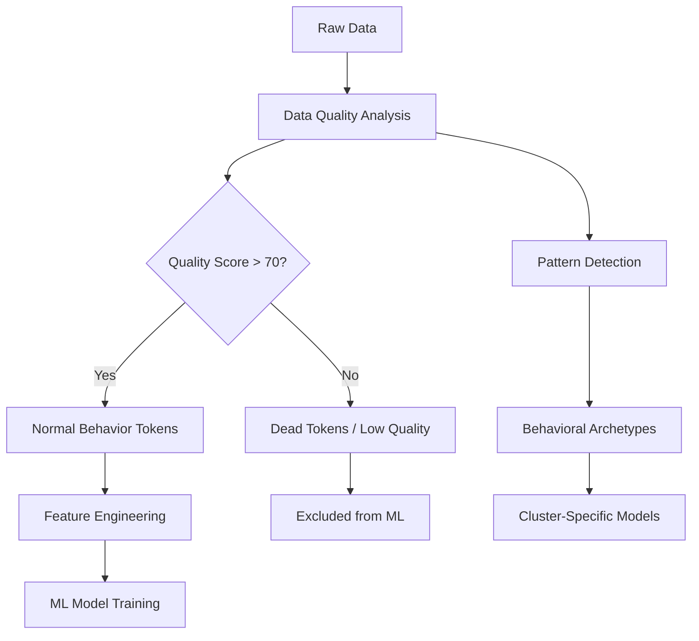

# 📊 Data Analysis Module

> **Comprehensive Streamlit-based analysis platform for memecoin time series data quality assessment, pattern detection, and behavioral insights**

## 🎯 Overview

The `data_analysis` module is the primary interactive interface for exploring and analyzing 24-hour minute-by-minute memecoin trading data. Built on **Polars** for high-performance data processing and **Streamlit** for interactive visualization, this module provides powerful tools for:

- **Data Quality Assessment**: Comprehensive evaluation of token data integrity and completeness
- **Price Pattern Analysis**: Technical indicators, volatility metrics, and trading behavior detection  
- **Behavioral Archetype Discovery**: Identification of distinct memecoin trading patterns
- **Token Categorization**: Automated classification and export of tokens by behavior type
- **Multi-Token Comparison**: Side-by-side analysis and pattern correlation studies

### 🪙 Memecoin-Specific Context

**CRITICAL**: This module is specifically designed for **24-hour minute-by-minute memecoin data** where:
- Every minute in the 24h cycle is equally relevant (no "historical vs recent" bias)
- Extreme volatility (99.9% dumps, 1M%+ pumps) represents **legitimate trading signals**
- Purpose is **data quality filtering** for ML pipeline preparation, not trading strategy generation
- Token lifespans vary dramatically (200-2000 minutes) requiring per-token scaling strategies

---

## 🏗️ Architecture & Components

### **Core Files**

#### **🚀 Primary Entry Point**
- **`app.py`** - Main Streamlit dashboard with comprehensive analysis interface
  - Interactive data source management with auto-discovery
  - Multi-tab interface for different analysis types
  - Session state management for optimal performance
  - Real-time progress tracking and caching

#### **⚙️ Core Engine Components**
- **`data_loader.py`** - High-performance Polars-based data loading engine
  - Automatic project root detection and path resolution
  - Flexible subfolder support (`raw/`, `processed/`, `cleaned/`)
  - Intelligent caching system for repeated analysis
  - Robust error handling for missing or corrupted files

- **`data_quality.py`** - Comprehensive data quality assessment engine
  - **Quality scoring system** (0-100) with detailed breakdowns
  - **Gap detection** and temporal continuity analysis
  - **Extreme value identification** (preserving legitimate volatility)
  - **Completeness metrics** and interpolation recommendations
  - **Dead token detection** using memecoin-appropriate thresholds

- **`price_analysis.py`** - Advanced price pattern and technical analysis
  - **Technical indicators**: RSI, Bollinger Bands, moving averages
  - **Memecoin-specific patterns**: pump detection, rug pull identification
  - **Volatility analysis** with extreme value preservation
  - **Trading signal generation** and momentum analysis
  - **Risk-return profiling** and performance metrics

#### **🔧 Utility & Support**
- **`export_utils.py`** - Category-aware token export functionality
  - Automated folder structure creation in `data/processed/`
  - Token categorization and batch export capabilities
  - Project root path resolution and validation

- **`analyze_tokens.py`** - Batch token analysis and pattern recognition
  - High-performance batch processing for large datasets
  - Statistical analysis and pattern classification
  - Token comparison and ranking algorithms

- **`token_overlap_analyzer.py`** - Inter-category overlap analysis tool
  - Command-line interface for automated analysis
  - Comprehensive overlap detection and reporting
  - Multi-category token identification and resolution
  - JSON export for further analysis integration

- **`run_data_analysis_standalone.py`** - Non-interactive analysis pipeline
  - Complete analysis workflow without Streamlit interface
  - Automated report generation and export
  - Batch processing capabilities for large-scale analysis

### **Testing Framework**
- **`tests/`** - Comprehensive mathematical validation test suite
  - **16/16 mathematical validation tests passing**
  - **1e-12 precision validation** against NumPy/SciPy references
  - Edge case testing for numerical stability
  - Integration tests for end-to-end workflows
  - Parametric testing for various data distributions

---

## 🚀 Getting Started

### **Quick Start**
```bash
# Launch the main dashboard (primary entry point)
streamlit run data_analysis/app.py

# Alternative: run from project root
cd /path/to/memecoin2
streamlit run data_analysis/app.py
```

### **Prerequisites**
```bash
# Install core dependencies
pip install polars streamlit plotly numpy scikit-learn

# Or install complete requirements
pip install -r requirements.txt
```

### **Data Structure Requirements**
```
data/
├── raw/                        # Raw dataset storage
│   └── dataset/               # Primary dataset folder
│       ├── TOKEN1_data.parquet
│       ├── TOKEN2_data.parquet
│       └── ...
├── processed/                  # Categorized token exports
│   ├── normal_behavior_tokens/
│   ├── dead_tokens/
│   ├── tokens_with_extremes/
│   └── tokens_with_gaps/
└── cleaned/                   # Cleaned datasets ready for ML
```

**Required Parquet Schema:**
```python
{
    'datetime': pl.Datetime,    # UTC timestamps (1-minute intervals)
    'price': pl.Float64,        # Token price in quote currency
    'volume': pl.Float64        # Trading volume (optional)
}
```

---

## 💡 Core Functionality

### **🔍 Data Quality Analysis**

#### **Quality Scoring System (0-100)**
- **95-100**: Excellent - Ready for ML pipeline
- **85-94**: Good - Minor interpolation may be needed
- **70-84**: Fair - Some data gaps or anomalies present
- **50-69**: Poor - Significant quality issues
- **0-49**: Unusable - Major data corruption or incompleteness

#### **Quality Metrics**
```python
# Core quality indicators
metrics = {
    'completeness_percentage': float,     # % of expected data points present
    'gap_count': int,                    # Number of temporal gaps > 1 minute
    'gap_total_minutes': int,            # Total gap duration
    'extreme_changes': int,              # Price changes > 10,000% per minute
    'duplicate_count': int,              # Duplicate timestamp entries
    'data_point_count': int,             # Total valid observations
    'quality_score': float               # Composite 0-100 score
}
```

#### **Dead Token Detection (Memecoin-Optimized)**
```python
# Memecoin-appropriate thresholds
dead_token_criteria = {
    'max_flat_period_hours': 2.0,       # Max identical price duration
    'min_cv_threshold': 0.001,           # Min coefficient of variation (0.1%)
    'tick_frequency_threshold': 0.8,     # Min price change frequency
    'signal_strength_threshold': 0.3,    # Min trading activity signal
    'decision_criteria_count': 3         # Minimum criteria for dead classification
}
```

### **📈 Price Pattern Analysis**

#### **Technical Indicators**
- **RSI (Relative Strength Index)**: Momentum oscillator (0-100)
- **Bollinger Bands**: Volatility-based price channels
- **Moving Averages**: SMA/EMA with configurable periods
- **MACD**: Trend-following momentum indicator
- **Volume Analysis**: Trading activity and liquidity metrics

#### **Memecoin-Specific Patterns**
```python
# Pattern detection thresholds
pattern_definitions = {
    'pump_and_dump': {
        'min_peak_gain': 5.0,           # 500% minimum peak
        'final_loss_threshold': -0.9,   # 90% loss from peak
        'peak_duration_max_hours': 4    # Maximum pump duration
    },
    'rug_pull': {
        'min_gain_before_dump': 10.0,   # 1000% gain required
        'dump_velocity': -0.8,          # 80% loss in short period
        'recovery_threshold': 0.1       # Less than 10% recovery
    },
    'whale_activity': {
        'large_move_threshold': 0.5,    # 50% price movement
        'frequency_threshold': 3,       # Multiple large moves
        'time_window_hours': 6          # Within 6-hour window
    }
}
```

### **🎯 Token Categorization System**

#### **Automated Categories**
1. **Normal Behavior Tokens** - Standard trading patterns, suitable for baseline ML models
2. **Dead Tokens** - Flatlined or extremely low activity, filtered from active analysis
3. **Tokens with Extremes** - High volatility with legitimate extreme moves (preserved signals)
4. **Tokens with Gaps** - Missing data periods requiring interpolation or exclusion

#### **Export Functionality**
```python
# Category export to processed folders
from data_analysis.export_utils import export_parquet_files

# Export high-quality tokens for ML pipeline
export_parquet_files(
    token_list=['TOKEN1', 'TOKEN2', ...],
    group_name='Normal Behavior Tokens'
)
# → Saves to data/processed/normal_behavior_tokens/
```

### **🔄 Multi-Token Comparison**

#### **Comparative Analysis Features**
- **Normalized price charts** - Align different price scales for pattern comparison
- **Performance ranking** - Sort by returns, volatility, Sharpe ratio
- **Pattern correlation matrix** - Identify similar behavioral signatures
- **Statistical clustering** - Group tokens by trading characteristics

---

## 📊 Dashboard Interface Guide

### **🏠 Main Dashboard Tabs**

#### **1. 📁 Data Source Selection**
- **Dataset Discovery**: Automatic scanning of `data/` folder structure
- **Subfolder Selection**: Choose from `raw/`, `processed/`, `cleaned/`
- **Token Count Display**: Real-time file count and data point estimates
- **Path Validation**: Verify data accessibility and format compliance

#### **2. 🔍 Data Quality Analysis**
- **Batch Quality Assessment**: Analyze hundreds of tokens simultaneously
- **Quality Score Distribution**: Histogram of quality scores across dataset
- **Issue Identification**: Detailed breakdown of data problems by type
- **Export Controls**: Save quality reports and categorized token lists

**Interface Controls:**
```python
# Quality analysis parameters
max_files_limit = st.slider("Maximum files to analyze", 1, 1000, 100)
export_categories = st.multiselect("Categories to export", 
                                  ["Normal Behavior", "Dead Tokens", "With Extremes"])
```

#### **3. 📈 Individual Token Analysis**
- **Token Selection**: Dropdown with search functionality
- **Interactive Charts**: Plotly-based price, volume, and indicator visualizations
- **Metrics Dashboard**: Real-time calculation of key performance indicators
- **Pattern Recognition**: Automated detection of pumps, dumps, and anomalies

**Key Visualizations:**
- **Price Evolution**: Candlestick or line charts with zoom/pan
- **Technical Indicators**: Overlay RSI, Bollinger Bands, moving averages
- **Volume Analysis**: Trading activity correlation with price movements
- **Return Distribution**: Histogram of minute-by-minute returns

#### **4. 🎯 Pattern Detection & Batch Analysis**
- **Multi-Token Processing**: Analyze patterns across entire datasets
- **Pattern Classification**: Automated categorization by trading behavior
- **Statistical Summaries**: Aggregate metrics and distribution analysis
- **Export Pipeline**: Direct integration with ML preparation workflows

#### **5. 📊 Comparative Analysis**
- **Token Selection**: Multi-select interface for 2-20 token comparison
- **Synchronized Charts**: Aligned timeframes and normalized scales
- **Correlation Analysis**: Statistical relationships between token patterns
- **Performance Ranking**: Sort by various metrics (returns, volatility, etc.)

### **🎛️ Advanced Controls**

#### **Filtering Options**
```python
# Quality-based filtering
min_quality_score = st.slider("Minimum Quality Score", 0, 100, 70)
max_gap_duration = st.number_input("Max Gap Duration (minutes)", value=60)
exclude_extremes = st.checkbox("Exclude extreme volatility tokens")

# Date range filtering (for datasets with timestamps)
date_range = st.date_input("Analysis Date Range", value=(start_date, end_date))
```

#### **Export Configuration**
```python
# Export settings
export_format = st.selectbox("Export Format", ["Parquet", "CSV", "JSON"])
include_metadata = st.checkbox("Include analysis metadata")
compression_level = st.slider("Compression Level", 1, 9, 6)
```

---

## 🛠️ Command Line Tools

### **Token Overlap Analyzer**
```bash
# Quick comparison between specific categories
python data_analysis/token_overlap_analyzer.py \
    --mode quick \
    --folder1 normal_behavior_tokens \
    --folder2 dead_tokens

# Comprehensive analysis of all category overlaps
python data_analysis/token_overlap_analyzer.py \
    --mode comprehensive \
    --processed-path /custom/path/to/processed

# Compare one category against all others
python data_analysis/token_overlap_analyzer.py \
    --mode quick \
    --folder1 tokens_with_extremes
```

**Output Example:**
```
📊 Token Overlap Analysis Results

Overlap Analysis: normal_behavior_tokens vs dead_tokens
├── Normal Behavior Tokens: 1,247 tokens
├── Dead Tokens: 2,891 tokens  
├── Overlap: 0 tokens (0.00%)
├── Normal Only: 1,247 tokens (100.00%)
└── Dead Only: 2,891 tokens (100.00%)

✅ No overlap detected - categories are mutually exclusive
```

### **Standalone Analysis Pipeline**
```bash
# Run complete analysis without Streamlit interface
python data_analysis/run_data_analysis_standalone.py \
    --dataset-path data/raw/dataset \
    --max-tokens 500 \
    --export-categories all \
    --output-report analysis_report.json
```

---

## 🧪 Testing & Validation

### **Mathematical Validation Framework**
```bash
# Run complete mathematical validation test suite
python -m pytest data_analysis/tests/test_mathematical_validation.py -v

# Specific test categories
python -m pytest data_analysis/tests/ -k "mathematical" --tb=short
python -m pytest data_analysis/tests/ -k "integration" --tb=short
```

### **Test Coverage**
- **✅ 16/16 Core Mathematical Tests Passing**
- **✅ Statistical Functions**: Mean, std dev, percentiles validated to 1e-12 precision
- **✅ Quality Metrics**: Gap detection, completeness calculation, scoring algorithms
- **✅ Price Analysis**: Technical indicators, return calculations, volatility metrics
- **✅ Edge Cases**: Empty data, single points, extreme values, missing timestamps
- **✅ Integration**: End-to-end workflow validation with real and synthetic data

### **Performance Benchmarks**
```python
# Typical performance characteristics
benchmark_results = {
    'token_loading': '~50ms per token (Polars)',
    'quality_analysis': '~10ms per token', 
    'price_analysis': '~25ms per token',
    'batch_processing': '~100 tokens/second',
    'memory_usage': '~2MB per 1000-minute token',
    'streamlit_rendering': '~500ms for dashboard update'
}
```

---

## ⚙️ Configuration & Customization

### **Quality Thresholds**
```python
# Customize in data_quality.py
quality_thresholds = {
    'completeness_min': 95.0,           # Minimum acceptable completeness %
    'max_gap_minutes': 5,               # Maximum acceptable gap duration  
    'max_extreme_changes': 5,           # Max extreme price changes allowed
    'max_duplicates': 0,                # Maximum duplicate timestamps
    'min_data_points': 60,              # Minimum viable dataset size (1 hour)
    'max_gap_for_interpolation': 10     # Maximum gap for safe interpolation
}

# Memecoin-specific extreme thresholds
extreme_thresholds = {
    'extreme_minute_return': 100.0,     # 10,000% in one minute (legitimate)
    'extreme_total_return': 10000.0,    # 1,000,000% total return (legitimate)
    'extreme_volatility': 100.0,        # 10,000% volatility (legitimate)
    'extreme_range': 100.0              # 10,000% price range (legitimate)
}
```

### **Pattern Detection Tuning**
```python
# Customize in price_analysis.py  
pattern_thresholds = {
    'pump_threshold': 0.5,              # 50% increase for pump detection
    'dump_threshold': -0.3,             # 30% decrease for dump detection  
    'volatility_threshold': 0.2,        # 20% std dev for volatility classification
    'trend_threshold': 0.02,            # 2% for trend detection
    'momentum_threshold': 0.01          # 1% for momentum shift detection
}
```

### **Performance Optimization**
```python
# Data loading optimization
caching_config = {
    'enable_polars_lazy': True,         # Use lazy evaluation where possible
    'chunk_size': 1000,                 # Tokens per processing batch
    'memory_limit_gb': 8,               # Maximum memory usage
    'parallel_workers': 4,              # Concurrent analysis threads
    'cache_intermediate': True          # Cache intermediate calculations
}
```

---

## 🔗 Integration with ML Pipeline

### **Data Flow Integration**


### **Export Pipeline**
```python
# Automated ML pipeline preparation
def prepare_ml_dataset(quality_threshold=80, max_tokens=None):
    """Prepare high-quality dataset for ML pipeline"""
    
    # 1. Load and analyze all tokens
    analyzer = DataQualityAnalyzer()
    quality_results = analyzer.batch_analyze(max_files=max_tokens)
    
    # 2. Filter high-quality tokens
    high_quality = [
        token for token, metrics in quality_results.items()
        if metrics['quality_score'] >= quality_threshold
    ]
    
    # 3. Export to processed folder
    export_parquet_files(high_quality, "Normal Behavior Tokens")
    
    # 4. Generate metadata
    metadata = {
        'total_analyzed': len(quality_results),
        'high_quality_count': len(high_quality),
        'quality_threshold': quality_threshold,
        'export_timestamp': datetime.now().isoformat()
    }
    
    return high_quality, metadata
```

---

## 🚨 Common Issues & Troubleshooting

### **❌ Data Loading Issues**

**Problem**: "No datasets found" error
```python
# Solution: Verify data structure
data_path = Path("data/raw/dataset")
if not data_path.exists():
    print(f"Create directory: {data_path}")
    data_path.mkdir(parents=True, exist_ok=True)

# Check for parquet files
parquet_files = list(data_path.glob("*.parquet"))
print(f"Found {len(parquet_files)} parquet files")
```

**Problem**: Memory errors with large datasets
```python
# Solution: Use batch processing
max_files_limit = 100  # Reduce batch size
enable_lazy_loading = True
clear_cache_frequency = 50  # Clear cache every N tokens
```

### **❌ Performance Issues**

**Problem**: Slow Streamlit dashboard updates
```python
# Solution: Optimize session state management
@st.cache_data
def load_token_data(token_name):
    """Cache token data to avoid reloading"""
    return data_loader.load_token(token_name)

# Use progress bars for long operations
progress_bar = st.progress(0)
for i, token in enumerate(token_list):
    progress_bar.progress((i + 1) / len(token_list))
```

**Problem**: High memory usage
```python
# Solution: Implement memory management
import gc

def process_batch_with_cleanup(tokens, batch_size=50):
    """Process tokens in batches with memory cleanup"""
    for i in range(0, len(tokens), batch_size):
        batch = tokens[i:i+batch_size]
        process_batch(batch)
        gc.collect()  # Force garbage collection
```

### **❌ Analysis Issues**

**Problem**: Extreme values causing calculation errors
```python
# Solution: Use robust statistical methods
def calculate_robust_statistics(prices):
    """Calculate statistics robust to extreme values"""
    # Use winsorization instead of outlier removal
    from scipy.stats import mstats
    winsorized_prices = mstats.winsorize(prices, limits=[0.01, 0.01])
    return {
        'mean': np.mean(winsorized_prices),
        'std': np.std(winsorized_prices),
        'median': np.median(prices)  # Median unaffected by extremes
    }
```

**Problem**: Inconsistent quality scores
```python
# Solution: Validate input data format
def validate_token_data(df):
    """Validate token data before analysis"""
    required_columns = ['datetime', 'price']
    missing_columns = [col for col in required_columns if col not in df.columns]
    
    if missing_columns:
        raise ValueError(f"Missing required columns: {missing_columns}")
    
    # Check for valid datetime format
    if not df['datetime'].dtype.is_temporal():
        raise ValueError("datetime column must be temporal type")
    
    # Check for positive prices
    if (df['price'] <= 0).any():
        raise ValueError("All prices must be positive")
```

---

## 📚 Advanced Usage Examples

### **Custom Analysis Workflow**
```python
from data_analysis.data_loader import DataLoader
from data_analysis.data_quality import DataQualityAnalyzer
from data_analysis.price_analysis import PriceAnalyzer

# 1. Initialize components
loader = DataLoader(subfolder="raw/dataset")
quality_analyzer = DataQualityAnalyzer()
price_analyzer = PriceAnalyzer()

# 2. Load and analyze token
token_data = loader.load_token("EXAMPLE_TOKEN")
quality_metrics = quality_analyzer.analyze_quality(token_data, "EXAMPLE_TOKEN")
price_metrics = price_analyzer.analyze_prices(token_data, "EXAMPLE_TOKEN")

# 3. Custom pattern detection
def detect_custom_pattern(df):
    """Detect custom trading pattern"""
    returns = df['price'].pct_change()
    
    # Define custom criteria
    has_pump = (returns > 5.0).any()  # 500% single-minute gain
    has_dump = (returns < -0.8).any()  # 80% single-minute loss
    high_volatility = returns.std() > 2.0  # High volatility
    
    return {
        'pattern_detected': has_pump and has_dump and high_volatility,
        'pattern_name': 'custom_extreme_volatility',
        'confidence': 0.85 if has_pump and has_dump else 0.3
    }

custom_pattern = detect_custom_pattern(token_data)
```

### **Batch Quality Analysis with Custom Export**
```python
def analyze_and_export_by_quality(min_quality=80, max_tokens=500):
    """Comprehensive quality analysis with smart categorization"""
    
    # Initialize
    loader = DataLoader()
    analyzer = DataQualityAnalyzer()
    
    # Get available tokens
    available_tokens = loader.get_available_tokens()[:max_tokens]
    
    # Analyze quality
    results = {}
    categories = {
        'excellent': [],    # 95-100
        'good': [],        # 80-94  
        'fair': [],        # 60-79
        'poor': []         # 0-59
    }
    
    for token_name in available_tokens:
        try:
            token_data = loader.load_token(token_name)
            quality_metrics = analyzer.analyze_quality(token_data, token_name)
            score = quality_metrics['quality_score']
            
            # Categorize by quality
            if score >= 95:
                categories['excellent'].append(token_name)
            elif score >= 80:
                categories['good'].append(token_name)
            elif score >= 60:
                categories['fair'].append(token_name)
            else:
                categories['poor'].append(token_name)
                
            results[token_name] = quality_metrics
            
        except Exception as e:
            print(f"Error analyzing {token_name}: {e}")
    
    # Export categories
    for category, tokens in categories.items():
        if tokens:
            export_parquet_files(tokens, f"quality_{category}")
    
    return results, categories
```

---

## 🎯 Performance Metrics & Benchmarks

### **Expected Performance**
```python
performance_targets = {
    'token_loading': {
        'target': '<100ms per token',
        'typical': '50-75ms',
        'factors': ['file size', 'disk speed', 'caching']
    },
    'quality_analysis': {
        'target': '<50ms per token',
        'typical': '10-25ms',
        'factors': ['data point count', 'complexity']
    },
    'dashboard_responsiveness': {
        'target': '<2s for UI updates',
        'typical': '500ms-1s',
        'factors': ['token count', 'chart complexity']
    },
    'memory_efficiency': {
        'target': '<4GB for 1000 tokens',
        'typical': '2-3GB',
        'factors': ['token size', 'caching strategy']
    }
}
```

### **Scalability Guidelines**
```python
scalability_recommendations = {
    'small_datasets': {
        'token_count': '<100',
        'batch_size': 'No limit',
        'memory_usage': '<1GB',
        'processing_time': '<30 seconds'
    },
    'medium_datasets': {
        'token_count': '100-1000',
        'batch_size': '50-100 tokens',
        'memory_usage': '2-4GB',
        'processing_time': '2-10 minutes'
    },
    'large_datasets': {
        'token_count': '1000+',
        'batch_size': '25-50 tokens',
        'memory_usage': '4-8GB',
        'processing_time': '10+ minutes',
        'recommendations': [
            'Use max_files_limit parameter',
            'Enable progress tracking',
            'Consider multi-processing',
            'Monitor memory usage'
        ]
    }
}
```

---

## 🔮 Future Enhancements

### **Planned Features**
- **Real-time Data Integration**: Live market data streaming and analysis
- **Advanced ML Pattern Recognition**: Automated behavioral archetype detection
- **Volume Analysis Integration**: Trading volume correlation with price patterns
- **Cross-Exchange Comparison**: Multi-source data aggregation and analysis
- **API Integration**: RESTful API for programmatic access to analysis results

### **Technical Roadmap**
- **Performance Optimization**: GPU acceleration for large-scale analysis
- **Enhanced Visualization**: 3D pattern visualization and interactive charts
- **Advanced Filtering**: Machine learning-based quality prediction
- **Distributed Processing**: Cluster-based analysis for massive datasets
- **Real-time Alerts**: Pattern detection with notification system

---

## 📖 Related Documentation

- **[Main Project README](../README.md)** - Project overview and setup
- **[ML Pipeline Documentation](../ML/README.md)** - Machine learning integration
- **[Time Series Analysis](../time_series/README.md)** - Behavioral archetype analysis
- **[CLAUDE.md](../CLAUDE.md)** - Complete development guide and context

---

**🚀 Ready to analyze memecoin patterns with precision and insight!**

*Last updated: Comprehensive documentation reflecting current module capabilities and memecoin-specific optimizations*